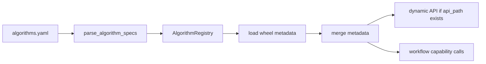

# AlgorithmController 统一算法能力方案设计

本文档记录 `peip_aihub` 当前的算法能力管理设计。旧方案中“在 peip 中重复定义输入模型、按工序注册 APC 算法、通过 `/algorithms/invoke` 统一调用”的思路已经被替换为当前方案：算法包提供能力与 metadata，`peip_aihub` 负责注册、加载、校验、API 暴露和 workflow 编排支撑。

## 设计目标

`peip_aihub` 作为算法能力网关，需要解决四类问题：

- 统一加载 wheel 形式发布的算法包。
- 复用算法包自带的输入输出模型，避免在 peip 中重复定义领域类。
- 基于算法包 metadata 自动获得算法说明、capabilities、输入输出模型路径。
- 将“HTTP API 暴露”和“workflow 内部能力调用”分离，避免 API 路由设计影响内部编排。

## 当前设计结论

当前设计不要求所有算法类继承同一个父类。算法包只需要提供稳定的 factory 和 metadata 入口，`peip_aihub` 在 `app/algorithms` 中完成统一适配。

推荐算法包暴露：

```python
def create_algorithm(config: Mapping[str, Any] | None = None) -> Any: ...

def get_algorithm_metadata(config: Mapping[str, Any] | None = None) -> dict[str, Any]: ...
```

其中 `get_algorithm_metadata()` 返回：

- `algorithm_id`
- `family`
- `version`
- `provider`
- `description`
- `when_to_use`
- `capabilities`
- `input_model`
- `output_model`
- `tags`

`peip_aihub` 会用配置文件中的显式 metadata 覆盖算法包默认 metadata：

```text
wheel metadata < algorithms.yaml metadata
```

## 当前 APC 算法类设计

`APC_Test` 中的 `APCAlgorithm` 是一个统一 APC 算法服务类，不再按工序拆分为 `apc.r2r_controller.rb`、`apc.r2r_controller.lp` 等多个算法。

当前职责：

- `APCAlgorithmMetadata`：提供算法身份、描述、capabilities、输入输出模型路径。
- `APCAlgorithm`：提供 `process_data()`、`control()`、`adjust()` 三个能力方法。
- `APCInput`：负责输入模型、字段说明、示例、payload 转换和 APC 请求基础校验。
- `APCResult`：负责输出模型和响应结构。

`process` 不再属于算法 metadata，也不再用于构造 `APCAlgorithm`。具体工序由请求体中的 `APCInput.process` 决定。

```python
class APCAlgorithm:
    @property
    def algorithm_id(self) -> str: ...

    def process_data(self, payload: Mapping[str, Any] | APCInput | None = None) -> dict[str, Any]: ...

    def control(self, data: dict[str, Any] | None = None) -> APCResult: ...

    def adjust(self, payload: Mapping[str, Any] | APCInput | None = None) -> APCResult: ...
```

APC metadata 中的 capabilities：

```text
adjust
process_data
control
```

## 配置模型

`configs/algorithms.yaml` 只负责 peip 侧注册信息和可选 API 暴露信息。算法说明、输入模型、输出模型、capabilities 等信息由 wheel metadata 提供。

当前 APC 配置：

```yaml
algorithms:
  apc.r2r_controller:
    package: apc-engine
    class_path: apc_engine.create_algorithm
    metadata:
      algorithm_id: apc.r2r_controller
      api_path: /apc/adjust
    call:
      mode: method
      method: adjust
```

字段含义：

- `package`：算法包名称，用于说明依赖来源。
- `class_path`：算法加载入口，当前 APC 使用 `apc_engine.create_algorithm`。
- `metadata.algorithm_id`：peip 注册 ID。
- `metadata.api_path`：需要暴露 HTTP API 时配置。没有该字段时不会动态注册 API。
- `call`：HTTP API 实际调用的算法能力方法。

## API 暴露与内部调用分离

当前设计明确区分两种场景。

### 需要开放 HTTP API

当算法能力需要给前端或外部系统调用时，配置 `metadata.api_path` 和 `call`。

例如：

```yaml
metadata:
  algorithm_id: apc.r2r_controller
  api_path: /apc/adjust
call:
  mode: method
  method: adjust
```

该配置会注册：

```text
POST /api/v1/algorithms/apc/adjust
```

动态 API 注册时会读取合并后的 metadata：

- `input_model` 用于请求体 schema。
- `output_model` 用于响应 schema。
- `api_path` 用于路由路径。
- `call` 用于确定实际调用方法。

如果未配置 `api_path`，即使算法 metadata 中存在 `input_model` 和 `output_model`，也不会自动开放 HTTP API。

### 只供 workflow 内部调用

如果算法只用于 LangGraph workflow 或其他后端流程，可以只注册算法，不配置 `api_path` 和 `call`。

```yaml
algorithms:
  apc.r2r_controller:
    package: apc-engine
    class_path: apc_engine.create_algorithm
    metadata:
      algorithm_id: apc.r2r_controller
```

这种情况下算法不会出现在动态 HTTP API 中，但仍可通过 `AlgorithmRegistry.require()` 获取算法实例，并根据 metadata 中的 `capabilities` 调用指定方法。

## 运行时加载流程



关键模块：

- `app/algorithms/specs.py`：解析 `algorithms.yaml`。
- `app/algorithms/registry.py`：维护算法 spec，加载并合并 wheel metadata。
- `app/algorithms/loader.py`：根据 `class_path` 和 constructor 规则实例化算法。
- `app/algorithms/handle.py`：按 `call` 规则执行默认调用。
- `app/algorithms/io.py`：根据 metadata 中的 `input_model`、`output_model` 解析输入和规范化输出。
- `app/api/routes/algorithm_dynamic_route.py`：只有配置 `api_path` 时才动态注册 HTTP API。

## 默认 API 调用流程

当算法配置了 `api_path` 和 `call` 后，请求流程为：

```mermaid
flowchart LR
    req["HTTP Request"] --> route["Dynamic API Route"]
    route --> registry["AlgorithmRegistry.invoke"]
    registry --> handle["AlgorithmHandle.invoke"]
    handle --> parse["parse_input via input_model"]
    parse --> call["CallAdapter method/pipeline/auto"]
    call --> normalize["normalize_output via output_model"]
    normalize --> resp["ResponseModel"]
```

当前 APC API：

```text
POST /api/v1/algorithms/apc/adjust
```

对应配置：

```yaml
call:
  mode: method
  method: adjust
```

因此该 API 会调用 `APCAlgorithm.adjust()`。

## Workflow 调用 capabilities

Workflow 不应该依赖 HTTP API，也不应该通过 HTTP 回调本服务。推荐直接通过 registry 获取算法 handle，并按 metadata 中的 `capabilities` 调用指定方法。

示例：

```python
from app.algorithms.handle import to_jsonable
from app.algorithms.service import get_algorithm_registry


def call_algorithm_capability(algorithm_id: str, capability: str, payload: dict) -> dict:
    registry = get_algorithm_registry()
    handle = registry.require(algorithm_id)

    capabilities = set(handle.spec.metadata.get("capabilities", []))
    if capability not in capabilities:
        raise ValueError(f"{algorithm_id} does not support capability: {capability}")

    method = getattr(handle.instance, capability, None)
    if not callable(method):
        raise ValueError(f"{algorithm_id} capability is not callable: {capability}")

    result = method(payload)
    return to_jsonable(result)
```

APC workflow 示例：

```python
payload = {
    "machine_id": "M01",
    "tube_id": "T01",
    "target_p": 100.0,
    "p_data": {"p1_mean": [96.0, 97.0, 98.0]},
    "adj_data": {},
    "adjust_max_limit": 2,
    "process": "RB",
}

features = call_algorithm_capability("apc.r2r_controller", "process_data", payload)
result = call_algorithm_capability("apc.r2r_controller", "adjust", payload)
control_result = call_algorithm_capability("apc.r2r_controller", "control", features)
```

注意：直接调用 capability 会绕过配置中的默认 `call` 策略。对于需要严格输入输出规范的 workflow，应封装专用 tool，在 tool 内显式处理输入模型解析和输出规范化。

## Instruction 接口

当前通用信息接口为：

```text
GET /api/v1/algorithms/instruction/{algorithm_id}
```

该接口只返回算法 metadata，不返回完整 input/output schema。

用途：

- 给前端展示算法说明。
- 给 LLM/tool 选择逻辑读取 `description`、`when_to_use`、`capabilities`。
- 帮助 workflow 判断算法是否支持某个 capability。

## 兼容策略

当前实现保留三种调用策略：

- `method`：调用算法实例上的单个方法。
- `pipeline`：按顺序调用多个方法。
- `auto`：优先调用 `invoke()`，否则调用 `adjust()`。

兼容原则：

- 老算法可以继续通过 `constructor` 和 `call` 适配。
- 新算法推荐提供 `create_algorithm()` 和 `get_algorithm_metadata()`。
- 输入输出模型优先由 wheel 自身提供。
- peip 不再重复定义 wheel 领域模型。

## 后续演进

- 在 `app/workflows` 中新增 LangGraph workflow。
- 为 workflow 封装 capability tool，避免散落 `getattr()` 调用。
- 为 capability tool 增加输入模型解析和输出模型规范化。
- 将 `GET /instruction/{algorithm_id}` 的 metadata 暴露给 LLM tool 选择逻辑。
- 对只注册但不开放 API 的算法补充 workflow 层测试。
- 对 wheel metadata 加载失败增加可观测日志，避免动态 API 静默缺失。

## 当前判断

当前方案已经完成从“配置式调用”到“可发现、可描述、可校验、可动态开放 API、可内部按 capability 编排”的演进。

后续重点不再是定义统一父类，而是加强 metadata 规范、workflow tool 封装和错误可观测性。
