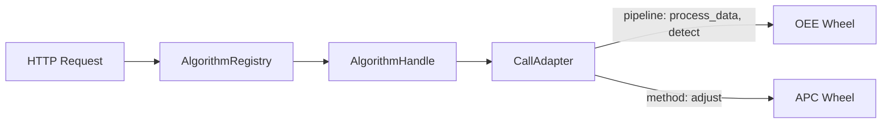

# AlgorithmController 统一算法能力方案设计

## 任务记录

目标：评估并设计 APC 与 OEE 算法能力在 `peip_aihub` 下的统一封装方式，使不同 wheel 算法可以通过一致的控制器接口被注册、校验、调用和展示。

背景：

- OEE 类算法当前通常是 `process_data -> detect` 的 pipeline 形式，例如 `sensor_analysis.temperature.TemperatureAnalyzer`、`PressureDetector`。
- APC 类算法当前通常是单方法形式，例如 `apc_engine.APCEngineController.adjust(APCInput)`。
- `peip_aihub` 已经通过 `AlgorithmSpec`、`AlgorithmHandle.invoke()` 和配置文件把二者统一为可声明的调用策略。
- 下一步希望把“调用统一”推进到“元数据统一 + 输入 schema 统一 + HTTP 校验统一”。

## 设计结论

方案可行，但建议以 `peip_aihub` 的适配层为统一边界，不强制要求 OEE/APC wheel 内部类继承同一个父类。

推荐方向：

- 保留 wheel 原始类自己的领域模型和内部流程。
- 在 `peip_aihub` 中定义统一的 `AlgorithmController`/`AlgorithmInput` 抽象。
- 通过配置或适配器把现有 `method`、`pipeline` 调用包装成统一 `process()`。
- HTTP request 校验阶段按 `algorithm_id` 获取对应输入 schema，再执行算法私有校验。

## 现状分析

当前 `peip_aihub` 已有统一调用雏形：

- `app/core/specs.py` 定义 `AlgorithmSpec`、`ConstructorSpec`、`CallSpec`。
- `app/core/handle.py` 定义 `AlgorithmHandle.invoke()` 和 `CallAdapter`。
- `configs/algorithms.example.yaml` 已能声明 OEE pipeline 和 APC method。

现有能力示意：



不足：

- `AlgorithmSpec.metadata` 只是自由 dict，缺少稳定字段约定。
- `payload` 在 API 层仍是 `dict[str, Any]`，没有按算法选择 schema。
- `CallAdapter` 只负责调用，不负责输入校验。
- OEE/APC 的输出被转成 JSON，但没有统一结果包装元信息。

## 目标接口

### AlgorithmMetadata

建议将元数据标准化为：

```python
@dataclass(frozen=True, slots=True)
class AlgorithmMetadata:
    algorithm_id: str
    family: str
    version: str = "1"
    description: str = ""
    when_to_use: str = ""
```

字段语义：

- `algorithm_id`：全局唯一算法 ID。
- `family`：能力族，例如 `anomaly`、`apc`。
- `version`：算法或封装协议版本。
- `description`：算法功能说明。
- `when_to_use`：路由、UI、LLM 工具选择时可读的适用条件。

### AlgorithmInput

建议定义输入基类或协议：

```python
class AlgorithmInput(Protocol):
    @classmethod
    def from_dict(cls, payload: dict[str, Any]) -> "AlgorithmInput": ...

    @classmethod
    def validate_payload(cls, payload: dict[str, Any]) -> None: ...

    @classmethod
    def json_schema(cls) -> dict[str, Any]: ...

    def to_dict(self) -> dict[str, Any]: ...
```

实现选择：

- 优先用 Pydantic `BaseModel` 作为 schema 来源。
- 对已有 wheel dataclass，可提供轻量 wrapper input model。
- 不建议在第一阶段把 `apc_engine.APCInput`、OEE `AlarmInput` 全部改成 Pydantic，避免破坏 wheel 兼容性。

### AlgorithmController

建议定义统一控制器协议：

```python
class AlgorithmController(Protocol):
    @property
    def metadata(self) -> AlgorithmMetadata: ...

    @property
    def input_model(self) -> type[AlgorithmInput]: ...

    def process(self, payload: AlgorithmInput | dict[str, Any]) -> Any: ...
```

对现有两类算法的映射：

- OEE pipeline：`process(payload)` 内部执行 `process_data(payload) -> detect(data)`。
- APC method：`process(payload)` 内部执行 `APCInput.from_dict(payload) -> adjust(input)`。

## 配置扩展建议

在现有 `algorithms.example.yaml` 基础上增加 `metadata` 和 `input`：

```yaml
algorithms:
  anomaly.sensor_analysis.temperature:
    family: anomaly
    package: oee-algo
    class_path: sensor_analysis.temperature.TemperatureAnalyzer
    metadata:
      version: "1"
      description: "温区升温、恒温、波动等异常检测"
      when_to_use: "请求包含温区温度曲线或标准 AlarmInput 温区传感器时使用"
    input:
      model: app.inputs.oee.TemperatureAlarmInputModel
      schema_mode: pydantic
    constructor:
      mode: positional
      args:
        - factory: sensor_analysis.SensorCfg
          value:
            name: temperature
            params:
              threshold: 0.7
              guard_margin: 0.1
              score_threshold: 0.3
              index_path: ${resource:sensor_analysis.temperature.DEFAULT_TEMPLATE_INDEX}
    call:
      mode: pipeline
      steps:
        - process_data
        - detect

  apc.r2r_controller.rb:
    family: apc
    package: apc-engine
    class_path: apc_engine.APCEngineController
    metadata:
      version: "1"
      description: "RB 工艺 Run-to-Run 温区调整控制器"
      when_to_use: "请求包含 machine_id、tube_id、target_p、p_data、adj_data 时使用"
    input:
      model: app.inputs.apc.APCAdjustInputModel
      schema_mode: pydantic
    constructor:
      mode: kwargs
      kwargs:
        process: RB
    call:
      mode: method
      method: adjust
      input_factory: apc_engine.APCInput.from_dict
```

说明：

- `input.model` 是 `peip_aihub` 的校验模型，不一定等于 wheel 内部输入类。
- `call.input_factory` 仍然可以保留，用于把已校验 payload 转成 wheel 内部对象。
- 没有配置 `input.model` 的旧算法继续按当前逻辑透传 payload，以保持兼容。

## HTTP 校验流程

建议把 HTTP 请求处理调整为：


校验职责划分：

- `algorithm_id` 是否存在、是否注册：由 `AlgorithmRegistry` 负责。
- payload 是否符合算法字段要求：由 `input_model.validate_payload()` 负责。
- wheel 内部对象构造：由 `call.input_factory` 或 controller adapter 负责。
- 输出 JSON 化：继续由 `to_jsonable()` 负责。

## 建议新增模块

建议在 `peip_aihub` 中新增：

- `app/core/metadata.py`：标准 `AlgorithmMetadata`。
- `app/core/input_model.py`：`AlgorithmInput` 协议、schema/validation 辅助函数。
- `app/inputs/apc.py`：`APCAdjustInputModel`。
- `app/inputs/oee.py`：通用 `AlarmInputModel`，以及必要时的温度专用模型。
- `app/core/controller.py`：可选的 `AlgorithmController` 协议和 `ConfiguredAlgorithmController` 适配器。

现有模块调整：

- `app/core/specs.py`：扩展 `AlgorithmSpec`，解析 `metadata` 和 `input`。
- `app/core/handle.py`：在 `invoke()` 前支持 input model 校验。
- `app/api/models/algorithm_model.py`：API 请求仍接收 dict，但错误信息来自 input schema。
- `app/api/routes/algorithm_route.py`：返回 422/400 时带 schema 校验错误详情。

## 兼容策略

第一阶段不破坏现有调用：

- 未配置 `input.model` 的算法：沿用当前 `payload -> CallAdapter` 逻辑。
- 已配置 `input.model` 的算法：先校验，再调用。
- `metadata` 缺失字段使用默认值。
- `AlgorithmHandle.invoke()` 继续作为外部主要入口。

后续阶段可以逐步演进：

- 新算法 wheel 原生提供 `metadata`、`input_model`、`process()`。
- `peip_aihub` 优先识别原生 `AlgorithmController`。
- 对旧 wheel 继续使用配置适配。

## 实施步骤

1. 扩展 `AlgorithmSpec`：增加 `input_model`、标准 metadata 字段解析。
2. 新增 Pydantic 输入模型：先覆盖 APC 调整和 OEE 标准 AlarmInput。
3. 在 `AlgorithmHandle.invoke()` 前执行可选 schema 校验。
4. 更新 `configs/algorithms.example.yaml`，为 APC 和 OEE 示例补充 `metadata`/`input`。
5. 为 `/algorithms/invoke` 增加 schema 错误测试。
6. 增加算法信息接口中的 metadata/schema 展示能力，便于 peip 项目或前端读取。

## 风险与应对

- 风险：OEE 温度算法和标准 AlarmInput 字段并不完全一致。
  应对：先定义通用 `AlarmInputModel`，温度算法需要时单独提供 `TemperatureAlarmInputModel`。

- 风险：wheel 内部 `from_dict()` 有自己的宽松转换逻辑，Pydantic 校验过严可能拒绝历史请求。
  应对：第一阶段 schema 保持“必要字段 + 基本类型”校验，数值范围逐步收紧。

- 风险：APC 输出在不同版本中可能是 list 或 actuator dict。
  应对：继续保留 `to_jsonable()` 和结果兼容转换，不在统一控制器中强制统一业务输出结构。

- 风险：把 schema 放在 wheel 内会造成发布节奏耦合。
  应对：第一阶段 schema 放在 `peip_aihub`，未来 wheel 可选导出自身 schema。

## 推荐落地判断

建议推进。`peip_aihub` 本身已经是算法网关，最适合承载统一算法控制器和输入 schema 的设计。第一阶段重点不是重写 OEE/APC，而是把现有配置式调用升级为可发现、可校验、可描述的统一算法能力层。
