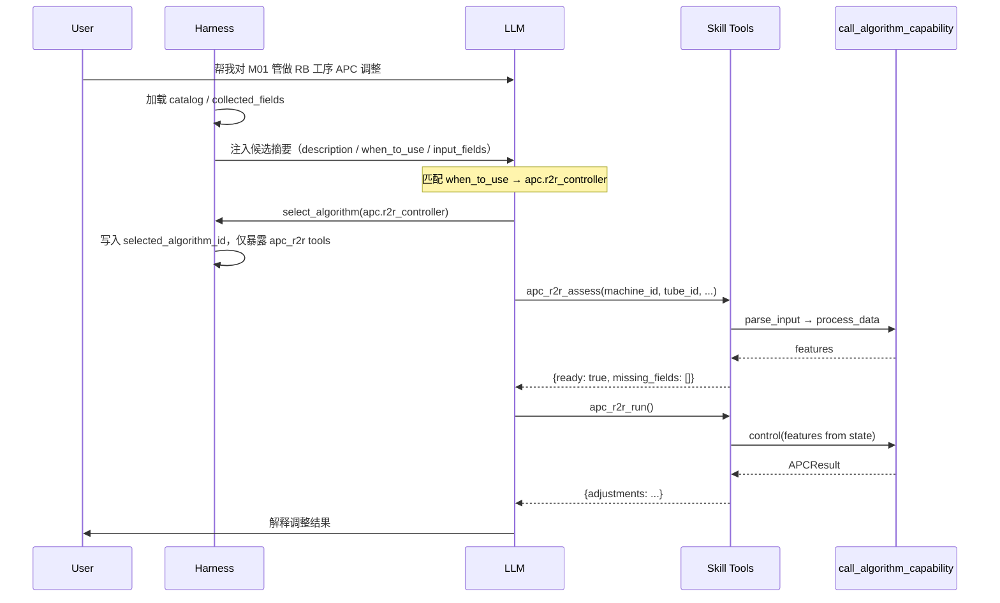
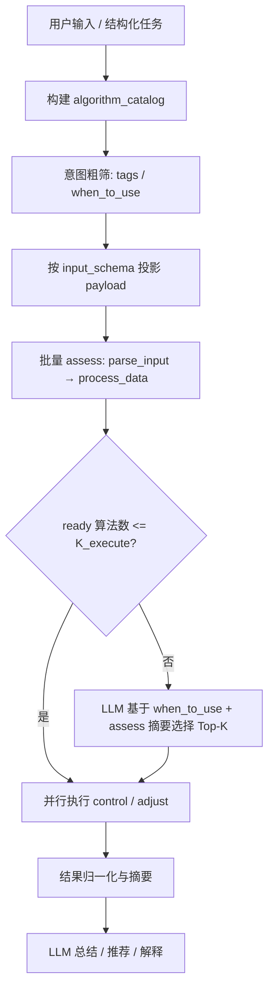

# LLM + Algorithm 调度 Skill / Tool 设计

本文档说明在 `peip_aihub` 中，如何将已注册算法能力接入 LLM 调度体系，包括：

- **Workflow 模式**：确定性流程先做算法筛选、并行执行，再交给 LLM 总结判定。
- **ReAct + Harness 模式**：Harness 负责上下文管控与候选收敛，LLM 通过语义化 Skill / Tool 多轮调用算法完成任务。

两种模式都复用现有 `AlgorithmRegistry`、metadata 合并、实例缓存和 `call_algorithm_capability` 执行入口，但不能把 wheel 原始 capability 直接暴露给 LLM。

前置阅读：[Workflow 调用算法 Capability 设计](./workflow_call_algorithm_capability.md)

## 背景

当前设计已满足 **workflow 固定编排**：将算法 capability 作为 LangGraph node 编入图中，由代码显式决定调用顺序。

若需将算法能力作为 **Skill / Tool 由 LLM ReAct 自主调度**，则需要在 `call_algorithm_capability` 之上再包一层 **语义化 Skill 接口**，并将 capability 编排细节对 LLM 隐藏。

典型场景（以 APC 为例）：

- `process_data`：校验输入是否满足算法要求，并提取控制特征（features）
- `control`：基于 features 执行实际控制，产出 `APCResult`
- `adjust`：一步式快捷路径（内部等价于完整流程）

LLM 不应直接选择调用 `process_data` 还是 `control`，而应选择语义明确的 Skill（如「评估数据是否就绪」「执行 APC 控制」）。

同时要区分两类筛选信号：

| 信号 | 回答的问题 | 来源 | 典型用途 |
|------|------------|------|----------|
| `description` / `when_to_use` / `tags` | 用户意图是否适合该算法 | algorithm metadata | 意图粗筛、Top-K 裁剪 |
| `process_data` / `{skill}_assess` | 当前数据是否能运行该算法 | payload + input model + capability | 数据适配、缺字段追问 |

`when_to_use` **不是 tool 调用参数**，而是模型初步筛选算法能力时的参照。真正调用 tool 时，参数来自 `describe_io_models()` / input schema。

## 设计原则

**LLM ReAct 走 Skill / Tool 语义层，底层执行仍统一走 `call_algorithm_capability`，不使用算法 Web API。**

- LLM **禁止**直接看到或调用原始 capability（`process_data` / `control` / `adjust`）作为独立 tool。
- LLM **禁止**通过 HTTP 调用 `POST /api/v1/algorithms/...`。
- LLM **禁止**直接 `import` wheel 内部类，或自行拼接 `control` 的 features 输入。
- Skill / Tool 实现层负责：`parse_input` → capability 编排 → 中间态写入 state → 返回 LLM 可读摘要。
- 执行入口与 workflow node 相同：`call_algorithm_capability(algorithm_id, capability, payload)`。
- `process_data` 可作为算法包的数据初筛能力，但 peip 侧必须把不同 wheel 的返回值、异常和空结果统一包装为 `AssessResult` / `ScreenResult`。
- 多算法筛选时，应先用 `when_to_use` / `tags` 做意图粗筛，再用 `assess` 做数据精筛，避免对无关算法全量执行。

## 三层分离

```text
LLM 可见层（Skill / Tool）        ← 意图理解、字段抽取、结果解释、必要时 Top-K 选择
        ↓
Harness / Workflow 管控层         ← catalog、候选集、阈值 K、上下文注入、并行调度
        ↓
Tool 编排层（app/workflows）      ← parse_input → process_data → control、state 读写
        ↓
Capability 执行层（已有）          ← call_algorithm_capability
```

| 层级 | 职责 | 调用方 |
|------|------|--------|
| Skill / Tool | 语义化接口、参数 schema、错误摘要 | LLM ReAct |
| Harness / Workflow 管控 | 候选筛选、上下文裁剪、Top-K、并行执行、硬约束 | peip workflow / LangGraph |
| Tool 编排 | `parse_input`、capability 流水线、state 读写 | peip workflow 代码 |
| Capability 执行 | registry 加载、反射调用、to_jsonable | `call_algorithm_capability` |

与固定编排 workflow 的关系：

- **Workflow 模式**：编排逻辑写在图中，适合确定性流程、多算法并行执行、LLM 事后总结。
- **ReAct + Harness 模式**：Harness 先收敛候选和上下文，LLM 通过 Skill tool 多轮补齐字段、调用算法、解释结果。

两条路径底层执行层相同，但 LLM 参与的时机和可见 tool 集不同。

## 两种运行模式

### Workflow 模式

适用于输入数据已经较结构化、任务边界清晰、需要对多个算法结果做对比或仲裁的场景。

推荐流程：

```text
用户输入 / 结构化任务
  → 构建 algorithm_catalog
  → 意图粗筛（tags / family / when_to_use）
  → 对候选算法批量 assess（parse_input → process_data）
  → ready 算法数 <= K_execute
      → 并行执行 control / adjust
      → LLM 汇总、比较、解释结果
  → ready 算法数 > K_execute
      → LLM 基于 when_to_use + 数据摘要选择 Top-K
      → 并行执行 Top-K
      → LLM 汇总、比较、解释结果
```

注意：

- `process_data` 初筛只判断「数据是否适配」，不能替代 `when_to_use` 的意图判断。
- 已经完成 `process_data` 的算法，后续应优先复用 features 调 `control`，避免再次走 `adjust` 重复处理。
- `K_screen`（候选过多时触发 LLM 裁剪）和 `K_execute`（允许并行执行的上限）建议分开配置。
- LLM 总结前应明确 `comparison_mode`，例如 `select_best`、`compare_all`、`explain_each`，避免总结目标漂移。

### ReAct + Harness 模式

适用于需求不完整、需要多轮问答补字段、LLM 需要逐步调用算法完成任务的场景。

推荐流程：

```text
用户输入
  → Harness 加载 catalog
  → Harness / Router 基于 when_to_use 做意图粗筛
  → Harness 批量 assess 候选算法
  → 如果适配算法过多：
      → LLM 基于 when_to_use + assess 摘要选择最相关 Top-K 或单个算法
  → 将 selected_algorithm_id 写入 state
  → 只向 LLM 暴露已选 skill 的 tools
  → LLM ReAct：assess →（追问缺失字段 | run / adjust）→ 解释结果
```

注意：

- 批量初筛应由 Harness 执行，不应让 LLM 对大量算法逐个调用 `assess` tool。
- ReAct 阶段应只暴露已选算法的语义化 Skill tools，避免工具列表过大导致误选。
- `ready=false` 时由 Harness / tool 层硬性阻止 `run`，不能只依赖 prompt 约束。
- 多轮 QA 的权威数据源是 state；LLM 上下文只放摘要。

## 筛选与执行契约

### Algorithm Catalog

`algorithm_catalog` 是支撑选型的轻量上下文，来自 registry metadata 和 `describe_io_models()` 摘要。它不应包含 `class_path`、`package`、HTTP `api_path` 或完整 features。

推荐结构：

```python
algorithm_catalog = [
    {
        "algorithm_id": "apc.r2r_controller",
        "name": "apc_r2r",
        "family": "apc",
        "description": "用于 Run-to-Run APC 控制",
        "when_to_use": "当需要根据机台、管号、目标工艺指标和工艺测量数据生成 APC 调整量时使用。",
        "tags": ["apc", "r2r"],
        "input_fields": [
            {"name": "machine_id", "required": True},
            {"name": "tube_id", "required": True},
            {"name": "target_p", "required": True},
            {"name": "p_data", "required": True},
        ],
        "skills": ["assess", "run", "adjust"],
    }
]
```

### AssessResult / ScreenResult

当前 `invoke_capability()` 直调 capability 时不会自动执行 `parse_input`，且不同 wheel 的 `process_data` 失败语义不一致：可能返回 `{}`、抛异常或返回部分特征。因此 peip 侧必须把 `process_data` 包装成统一契约。

推荐契约：

```python
class AssessResult(TypedDict):
    algorithm_id: str
    ready: bool
    score: float | None
    missing_fields: list[str]
    errors: list[str]
    warnings: list[str]
    summary: str
    features: dict | None      # 仅 state 内部使用，不注入 LLM 上下文
```

生成规则：

- `parse_input` 失败：`ready=false`，解析字段级 `missing_fields` / `errors`。
- `process_data` 抛异常：`ready=false`，错误写入 `errors`。
- `process_data` 返回空特征：默认视为 `ready=false`，除非该算法 metadata 明确声明空结果合法。
- `process_data` 成功且 features 可用于后续 `control`：`ready=true`，features 写入 state。

`score` 是可选字段，供后续排序使用。初期可以为空，或由规则 / LLM 基于 `when_to_use` 与用户意图计算。

### 筛选顺序

推荐统一顺序：

```text
1. 意图粗筛：tags / family / when_to_use / description
2. Payload 投影：按算法 input_schema 从 collected_fields 构造候选 payload
3. 数据精筛：parse_input → process_data → AssessResult
4. 候选过多：LLM 基于 when_to_use + assess 摘要选 Top-K
5. 执行：control(features) 或 adjust(payload)
```

不要直接把同一份原始 payload 批量传给所有算法。不同算法的 `input_model` 不同，必须先按 schema 做字段投影和缺失字段判断。

## Skill 封装策略

### 不要把 capability 原样暴露给 LLM

`process_data` / `control` / `adjust` 是算法内部 capability，语义相近、输入输出存在依赖（`control` 的输入是 `process_data` 的输出，而非原始 `APCInput`）。若作为三个独立 tool 暴露，ReAct 极易选错步骤。

对 LLM 暴露的应是 **语义化 Skill**：

| LLM 可见 Tool | 内部 capability 编排 | 职责 |
|---------------|----------------------|------|
| `list_algorithm_skills` | 读 registry metadata | 发现可用算法 |
| `{skill}_assess` | `parse_input` → `process_data` | 校验数据是否满足算法、返回缺失字段 |
| `{skill}_run` | `control`（消费 assess 产出的 features） | 真正执行算法 |
| `{skill}_adjust`（可选） | `adjust` 一步式 | 数据已齐全时的快捷路径 |

说明：

- `algorithm_id` 绑定在 tool 实现内，或 assess 成功后写入 state，`run` 从 state 读取。
- `features`（`process_data` 输出）**不交给 LLM 构造**，仅存 workflow state。
- `assess` 内显式调用 `parse_input`，补齐 capability 直调缺少的 IO 校验（参见 [workflow 文档](./workflow_call_algorithm_capability.md) 中对高规范场景的建议）。
- `when_to_use` 放在 catalog 或 tool description 中，帮助模型判断「何时使用」，但不放进 `parameters`。

### APC 示例映射

```text
apc_r2r_assess  →  parse_input(APCInput)  →  process_data  →  state.validation
apc_r2r_run     →  control(state.validation.features)
apc_r2r_adjust  →  parse_input(APCInput)  →  adjust
```

`adjust` 与 `assess + run` 可并存：数据不全时走 assess 引导补齐；数据齐全时 LLM 可直接选 adjust。

## 推荐代码结构

```text
app/workflows/
  __init__.py           # re-export
  tools.py              # AlgorithmSkill 抽象 + LangGraph @tool 定义
  state.py              # AgentState Pydantic / TypedDict 模型
  skills/
    apc_r2r.py          # APC 具体 Skill 实现
```

### AlgorithmSkill 抽象（概念）

```python
from dataclasses import dataclass
from typing import Any

from app.algorithms.io import parse_input
from app.algorithms.service import call_algorithm_capability


@dataclass
class AssessResult:
    algorithm_id: str
    ready: bool
    missing_fields: list[str]
    errors: list[str]
    summary: str
    features: dict[str, Any] | None = None


@dataclass
class AlgorithmSkill:
    algorithm_id: str
    name: str              # LLM tool 名，如 "apc_r2r"
    description: str       # 来自 metadata.description
    when_to_use: str       # 来自 metadata.when_to_use
    input_schema: dict     # 来自 describe_io_models → input schema
    tags: list[str]

    def assess(self, payload: dict, registry) -> "AssessResult":
        spec = registry.get_spec(self.algorithm_id)
        try:
            parsed = parse_input(spec, payload)
            features = call_algorithm_capability(
                self.algorithm_id, "process_data", parsed, registry=registry
            )
        except Exception as exc:
            return AssessResult(
                algorithm_id=self.algorithm_id,
                ready=False,
                missing_fields=[],
                errors=[str(exc)],
                summary="输入不满足算法要求。",
            )
        if not features:
            return AssessResult(
                algorithm_id=self.algorithm_id,
                ready=False,
                missing_fields=[],
                errors=[],
                summary="算法未能从输入中提取可执行特征。",
            )
        return AssessResult(
            algorithm_id=self.algorithm_id,
            ready=True,
            features=features,
            missing_fields=[],
            errors=[],
            summary="数据满足算法运行条件。",
        )

    def run(self, features: dict, registry) -> dict:
        return call_algorithm_capability(
            self.algorithm_id, "control", features, registry=registry
        )
```

### LangGraph Tool 示例

```python
from langchain_core.tools import tool


@tool
def apc_r2r_assess(
    machine_id: str,
    tube_id: str,
    target_p: float,
    p_data: dict,
    process: str = "RB",
) -> dict:
    """评估 APC R2R 数据是否满足运行条件。
    当用户需要工艺调整、Run-to-Run 控制时使用。
    返回 ready / missing_fields，不执行实际控制。"""
    payload = {
        "machine_id": machine_id,
        "tube_id": tube_id,
        "target_p": target_p,
        "p_data": p_data,
        "process": process,
    }
    # tool 内部写死 algorithm_id；结果写入 state，仅返回 LLM 可读摘要
    ...


@tool
def apc_r2r_run() -> dict:
    """在 assess 返回 ready=true 后执行 APC 控制。
    不需要传入原始工艺数据，使用 state 中缓存的 features。"""
    features = get_state().validation["features"]
    return call_algorithm_capability("apc.r2r_controller", "control", features)
```

## ReAct 调度流程



若 `assess` 返回 `ready: false`，LLM 应追问缺失字段，**不得**强行调用 `run`。

## Workflow 多算法执行流程



Workflow 模式中，LLM 不参与每个算法的逐步工具调用。LLM 的主要职责是：候选过多时做 Top-K 选择，以及在算法结果产生后做业务解释、对比和最终判断。

## LLM 上下文持久化

分 **算法选择** 与 **执行编排** 两类信息。LangGraph state 是权威数据源；进入 LLM 对话上下文的仅为摘要，避免 token 膨胀与中间态误用。

### 一、支撑「选对算法」——相对静态

workflow 启动时或首次需要时加载，一般不变：

| 字段 | 来源 | 用途 |
|------|------|------|
| `algorithm_id` | metadata | 唯一标识 |
| `description` | metadata | 算法做什么 |
| `when_to_use` | metadata | 何时该选它 |
| `tags` / `family` | metadata | 粗筛（apc / oee / …） |
| `input_schema` 摘要 | `describe_io_models` | 需要哪些字段（字段名 + 是否必填 + 简短说明） |
| 业务约束 | metadata 扩展或 input schema | 如 APC 支持的 `process`（RB / LP 等） |

构建方式：

```text
GET /api/v1/algorithms/instruction/{algorithm_id}   # description, when_to_use, capabilities
describe_io_models(spec)                            # input / output schema 摘要
```

注入 system prompt，或作为 `list_algorithm_skills` tool 的返回值。算法数量较多时，优先让 Harness 按 `family` / `tags` / `when_to_use` 先裁剪 catalog，再注入 LLM。

**LLM 选择算法时不需要**：`class_path`、`package`、capabilities 列表、HTTP `api_path`。

### 二、支撑「正确执行」——动态，每轮 ReAct 更新

| 字段 | 写入时机 | 进入 LLM 上下文 | 用途 |
|------|----------|-----------------|------|
| `selected_algorithm_id` | LLM 决定调用某 skill 后 | 是 | 锁定当前算法，避免中途漂移 |
| `selection_reason` | 选型后 | 是 | 记录如何匹配 `when_to_use`，便于审计 |
| `candidate_algorithms` | Harness 初筛后 | 是（摘要） | 限定 ReAct 可选范围 |
| `collected_fields` | 每轮从对话抽取后 merge | 是（摘要） | 增量补齐 input |
| `missing_fields` | assess 失败或 parse_input 报错 | 是 | 引导 LLM 追问用户 |
| `validation.ready` | `process_data` 成功 | 是 | 是否可执行 control |
| `validation.errors` | 校验失败 | 是 | LLM 可读的错误（字段级） |
| `validation.features` | `process_data` 成功 | **否** | 仅存 state，供 `run` tool 消费 |
| `last_result` | control / adjust 成功 | 是（摘要） | 供 LLM 解释给用户 |
| `tool_trace` | 每次 tool 调用 | 可选 | 防重复调用、支持反思 |

原则：**features 全量是工具链中间数据，不持久化进 LLM 对话上下文**，只保留 `ready` / `missing_fields` / `errors` 等人可读摘要。

### 三、推荐 AgentState 结构

```python
from typing import Annotated, TypedDict

from langgraph.graph.message import add_messages


class AgentState(TypedDict):
    messages: Annotated[list, add_messages]

    # 算法选择上下文
    algorithm_catalog: list[dict]      # 启动时加载，一般不变
    candidate_algorithms: list[dict]   # Harness 粗筛 / assess 后的候选摘要
    selected_algorithm_id: str | None
    selection_reason: str | None

    # 领域数据（LLM 参与构建）
    collected_fields: dict             # 如 machine_id, tube_id, p_data...

    # 校验态（tool 写入，LLM 只读摘要）
    validation: dict | None            # {ready, missing_fields, errors, features}
    # features 在 validation 内，tool 层读写；注入 LLM 时剥离 features 字段

    # 执行结果
    algorithm_results: dict            # workflow 多算法结果，按 algorithm_id 存储
    last_result: dict | None
    tool_trace: list[dict]
```

上下文注入规则：

- 选型阶段：注入 catalog 摘要，重点包含 `when_to_use`、`description`、`tags`、必填字段摘要。
- 执行阶段：只注入已选 skill 的 tool schema 和 state 摘要，不重复注入全量 catalog。
- 总结阶段：注入结果摘要和必要 trace，不注入 features 全量。

## metadata 扩展建议（wheel 侧）

当前 metadata 仅有算法级 `capabilities` 列表，不足以自动生成 LLM tool。建议在 wheel `get_algorithm_metadata()` 中增加 **capability 角色声明**（或由 peip 侧 overlay）：

```yaml
capability_roles:
  process_data:
    role: validate          # validate | execute | shortcut
    exposes_to_llm: false
    input: APCInput
    output: features
    description: 校验输入并提取控制特征
    empty_result_means_not_ready: true
  control:
    role: execute
    exposes_to_llm: false
    input: features         # 明确依赖 process_data 输出
    output: APCResult
  adjust:
    role: shortcut
    exposes_to_llm: true
    input: APCInput
    output: APCResult
```

peip 据此自动生成：

- 仅将 `exposes_to_llm: true` 的 capability 映射为独立 tool；
- `validate + execute` 组合封装为一个 skill 的 `assess` / `run` 两阶段。
- 在批量筛选时只调用 `role: validate` 的 capability。
- 在并行执行时使用 `role: execute` 或 `role: shortcut` 的 capability。

建议补充算法级字段：

```yaml
selection:
  when_to_use: 当需要根据机台、管号、目标工艺指标和工艺测量数据生成 APC 调整量时使用
  intent_examples:
    - 对炉管做 Run-to-Run 调整
    - 根据目标方阻和测量数据计算 APC 调整量
  not_when:
    - 只做设备告警检测
    - 只查询历史报表
  default_k_score: 0.0
```

`intent_examples` / `not_when` 可提升小模型选型稳定性；它们和 `when_to_use` 一样只属于选型上下文，不属于 tool `parameters`。

## LLM 职责边界

**LLM 负责：**

- 理解用户意图
- 根据 catalog 中的 `description` / `when_to_use` 选择算法 skill
- 从对话中抽取 / 补齐 input 字段
- 在 `ready=false` 时追问缺失字段
- 解释 `last_result` 并回复用户
- 在候选过多时，基于 `when_to_use` 和 assess 摘要选择 Top-K

**LLM 不负责：**

- 选择调用 `process_data` 还是 `control`（由 skill tool 内部编排）
- 构造 `control` 所需的 features 中间态
- 直接 import wheel 内部类
- 拼接 `class_path` 或绕过 `AlgorithmRegistry`
- 通过 HTTP 请求算法 Web API
- 对全量算法逐个调用初筛 tool
- 在 `ready=false` 时强行执行 `run`

## 当前实现约束与风险

对照现有 `peip_aihub` 代码，落地前必须注意：

- `AlgorithmHandle.invoke_capability()` 只校验 capability 名并反射调用方法，不自动执行 `parse_input` / `normalize_output`。
- 不同 wheel 的 `process_data` 返回语义不统一，不能直接把它当成通用「适配判定 API」。
- 跨算法 payload 不统一，批量筛选前必须根据各自 input schema 做字段投影。
- `when_to_use` 只能判断意图相关性，不能证明数据可运行；`process_data` 只能判断数据适配，不能证明任务意图正确。
- 多算法并行执行后，结果格式可能不可比，需要结果摘要和 `comparison_mode`。
- 小模型（如本地边缘模型）容易受过大 tool 列表影响，ReAct 阶段应只暴露已选或 Top-K skill tools。

## 与现有能力的关系

| 已有能力 | ReAct 场景用法 |
|----------|----------------|
| `call_algorithm_capability` | Skill tool 实现层唯一执行入口 |
| `GET /instruction/{algorithm_id}` | 构建 algorithm catalog |
| `describe_io_models` | 生成 tool 参数 schema、`missing_fields` 提示 |
| `parse_input` / `normalize_output` | 在 assess / adjust tool 内显式调用 |
| `invoke()` HTTP API | 仍仅面向前端 / 外部，不给 LLM 使用 |
| LangGraph node 直调 | 固定编排 workflow 继续使用 |

## 推荐落地顺序

1. 定义 `AssessResult` / `ScreenResult` 标准结构，统一封装 `parse_input`、`process_data`、异常、空结果。
2. 实现 `build_algorithm_catalog()`，从 registry metadata + `describe_io_models()` 构建轻量选型上下文。
3. 实现 `screen_algorithms(payload, candidates)`，支持意图粗筛、字段投影、批量 assess、Top-K 裁剪。
4. 实现 `AlgorithmSkill` 与具体 APC skill：`apc_r2r_assess`、`apc_r2r_run`、`apc_r2r_adjust`。
5. 实现 Workflow 多算法模式：`screen → parallel execute → summarize`。
6. 实现 ReAct + Harness 模式：`catalog → select → expose selected tools → QA / run`。
7. 增加 trace 展示：候选来源、`when_to_use` 匹配理由、assess 结果、执行耗时、token 统计。

## 后续 TODO

- [ ] 新增 `app/workflows/tools.py`，实现 `AlgorithmSkill` 抽象
- [ ] 新增 `app/workflows/state.py`，定义 `AgentState`
- [ ] 新增 `AssessResult` / `ScreenResult` 标准契约
- [ ] 实现 `build_algorithm_catalog()`，从 registry metadata 构建轻量选型上下文
- [ ] 实现 `screen_algorithms()`，封装意图粗筛、字段投影、批量 assess 和 Top-K
- [ ] 实现 APC `apc_r2r_assess` / `apc_r2r_run` / `apc_r2r_adjust` tool
- [ ] 实现 `list_algorithm_skills`，从 registry metadata 构建 catalog
- [ ] tool 层统一错误包装，输出 LLM 可读的字段级错误
- [ ] wheel metadata 补充 `capability_roles` 声明
- [ ] 增加 Workflow 多算法并行执行示例：`screen → execute Top-K → LLM summarize`
- [ ] 增加 ReAct workflow 集成测试（assess 失败、补齐字段、assess → run 完整链路）
- [ ] 增加 LangGraph ReAct 图示例：`LLM → assess →（追问 | run）→ 解释结果`
